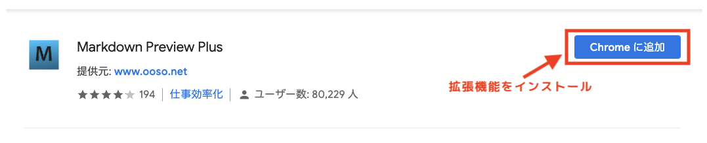
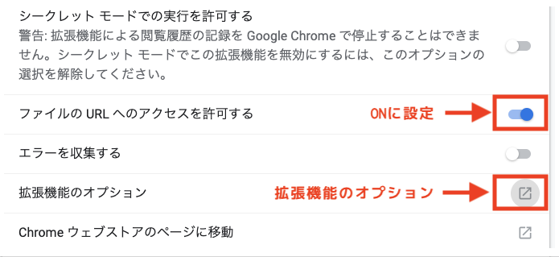
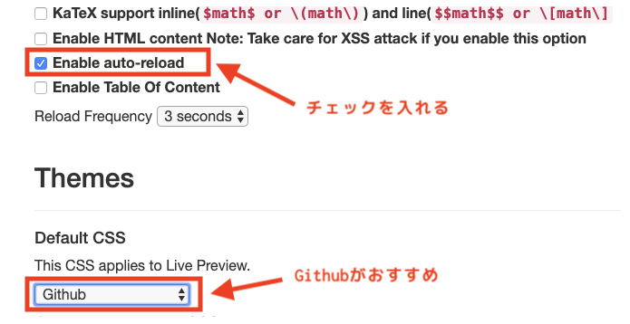
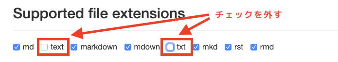
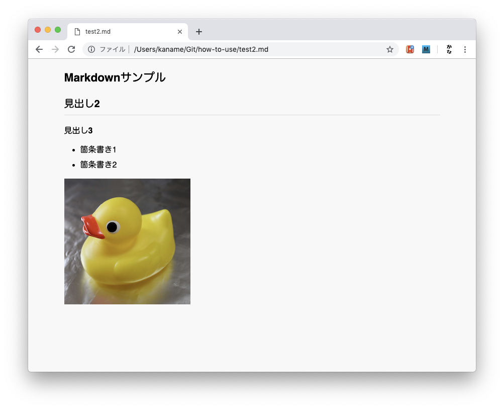

# Chromeでmarkdownをプレビューする方法

## 1. "Markdown Preview Plus"をインストール

Chromeで以下のページにアクセスし拡張機能をインストールします。

[Markdown Preview](https://chrome.google.com/webstore/detail/markdown-preview-plus/febilkbfcbhebfnokafefeacimjdckgl?hl=ja)

---

## 2. "Markdown Preview Plus"を設定

### 拡張機能の設定
インストールが完了したら、以下のURLにアクセスし拡張機能の設定を行います。

`chrome://extensions`

"Markdown Preview Plus"の"詳細"ボタンを押して拡張機能の設定ページに移動し、
"ファイルのURLへのアクセスを許可する"を"ON"に設定します。

### オプション設定
拡張機能設定画面から拡張機能のオプションを選択し、オプション画面に移動し以下のように設定を行います。

* "Enable auto-reload"にチェックを入れmarkdownファイルを変更したときも定期的にリロードし再表示します
* "This CSS applies Live Preview."を"Github"に設定（お好みで良い）
* "Supported file extensions"の"txt"と"text"のチェックを外す
  テキストファイルはmarkdownではないため

設定完了です。

---

## 3. 使い方
markdownのファイル(拡張子がmd)をブラウザにドラッグ&ドロップ等で開くと以下のようにPreviewを確認することが出来ます。

