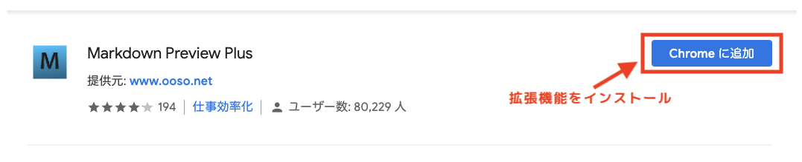
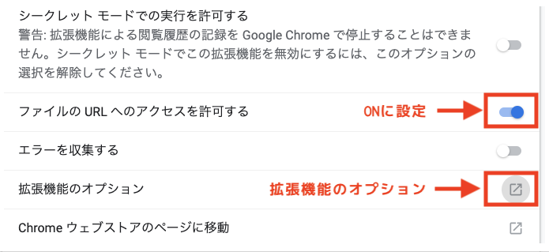
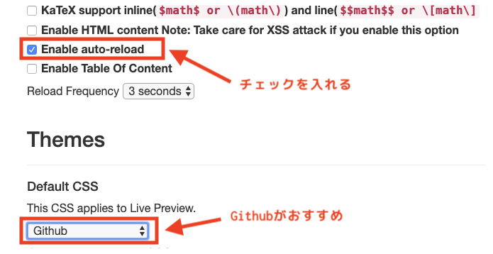
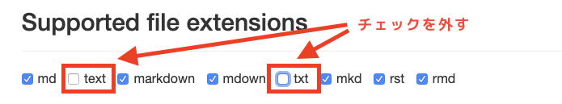

# Chromeでmarkdownをプレビューする方法

## 1. "Markdown Preview Plus"をインストール

Chromeで以下のページにアクセスし拡張機能をインストールします。

[Markdown Preview](https://chrome.google.com/webstore/detail/markdown-preview-plus/febilkbfcbhebfnokafefeacimjdckgl?hl=ja)

---

## 2. "Markdown Preview Plus"を設定

以下のURLにアクセスし拡張機能の設定を行います。

[拡張機能](chrome://extensions)

"Markdown Preview Plus"の"詳細"ボタンを押して拡張機能の設定ページに移動し、
"ファイルのURLへのアクセスを許可する"を"ON"に設定します。

拡張機能のオプションを選択し、オプション画面で以下のように設定を行う。x

* "Enable auto-reload"にチェックを入れる
* "This CSS applies Live Preview."を"Github"に設定
* "Supported file extensions"の"txt"と"text"のチェックを外す

---

## 3. 使い方
markdownのファイル(拡張子がmd)をブラウザにドラッグ&ドロップ等で開くとPreviewを確認することが出来ます。

