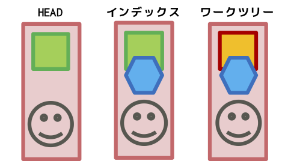

# Gitチートシート

## ツール初期設定

### ユーザ関連の設定 (user)
ユーザ名を設定（全リポジトリ共通） (user.name)
```
$ git config --global user.name "[name]"
```

emailアドレスを設定（全リポジトリ共通） (user.email)
```
$ git config --global user.email "[email address]"
```

### トラッキングの制限 (.gitigunore)
`.gitignore`ファイルを作成して、トラッキングしないファイル名のパターンをテキストで記述しておく

```
*~      # 末尾に~が付くemacsのバックアップファイルは無視
*.swp   # vimのswapファイルも無視
```


## 通常運用で使用するコマンド

### 複製作成 (clone)
リモートリポジトリからローカルにリポジトリを複製
```
$ git clone [remote repository URL]
```

### 差分表示 (diff)



ローカルリポジトリのワークツリー(work tree)に加えた変更とインデックス(index)の差分を表示する
```
$ git diff
```

ローカルリポジトリのワークツリーと現在のコミットの先頭(HEAD)を比較し差分を表示する
```
$ git diff HEAD
```


### 状態表示 (status)
現在のローカルリポジトリの状態取得
```
$ git status
On branch master
Your branch is ahead of 'origin/master' by 1 commit.
  (use "git push" to publish your local commits)

Untracked files:
  (use "git add <file>..." to include in what will be committed)

	git-cheat-sheet.md

nothing added to commit but untracked files present (use "git add" to track)
$ 
```

### 履歴の表示 (log)
リポジトリへの変更履歴を表示する
```
$ git log
commit 15327233dfb31c1a0b8f069100d249e322f2b94a (HEAD -> master)
Author: Kaname <kaname.g@gmail.com>
Date:   Wed Mar 27 01:43:13 2019 +0900

    レポジトリの構造の図を追加
    
    図を追加したのとPNGファイルを追加した

commit cd20cb50d10bac41c1e1c06e11a6829a78526dae (origin/master, origin/HEAD)
Author: Kaname <kaname.g@gmail.com>
Date:   Wed Mar 27 00:51:56 2019 +0900

    git diff HEADの項目

```
