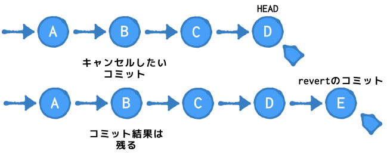
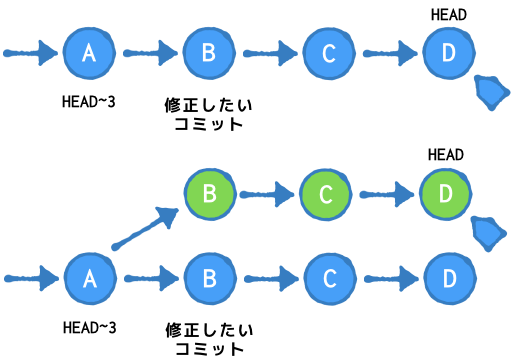

# Gitの使い方

ソースのバージョン管理システムであるGitについて、基本的で運用に十分な使い方を説明します。

1. ツールの初期設定
1. Gitレポジトリの構造
1. 通常の運用で使用するコマンド
1. 記録の間違いを修正する方法
1. ブランチの使い方
1. git-flowの使い方

--------------------------------------------------------------------------------------------------

## ツール初期設定

### ユーザ関連の設定 (user)
ユーザ名を設定（全リポジトリ共通）
`user.name`にユーザ名を設定
```
$ git config --global user.name "[name]"
```

emailアドレスを設定（全リポジトリ共通）
`user.email`にe-mailアドレスを設定
```
$ git config --global user.email "[email address]"
```

### トラッキングの制限
`.gitignore`ファイルを作成して、トラッキングしないファイル名のパターンをテキストで記述しておくことができます。

```
*~         # 末尾に~が付くemacsのバックアップファイルは無視
*.swp      # vimのswapファイルも無視
.DS_Store  # macのプレビューファイル
```

--------------------------------------------------------------------------------------------------

## Gitのレポジトリ構造
Gitのレポジトリの構成について説明します。この構成を理解していないとファイルを編集したりコマンドを実行した場合にどこのデータが編集や変更されるのかがわからなくなります。
Gitにはレポジトリに含まれている過去のコミットツリーとは別に、編集中のファイルが保存されている**ワークツリー**とコミット前のデータが保存される**インデックス**で構成されています。


### ワークツリー
ファイルに対して行われた編集はワークツリーに反映されます。エディタなどでファイルを編集し保存するとワークツリーの内容が変更されます。


### インデックス
ワークツリーに対して行われた編集のうちコミットに必要な編集はインデックスに**ステージング**します。


### コミット
コミットに必要な変更がインデックスにすべて追加されると、コミットを実行します。コミットを行うとレポジトリのコミットツリーに新たなコミットが追加されます。


## 通常運用で使用するコマンド

### 通常の更新手順
通常は以下のような手順でファイルを更新しリモートレポジトリの更新を行います。

1. リモートレポジトリからローカルに複製 `(clone)`
1. ファイルの編集
1. 差分を見て変更の確認 `(diff)`
1. ローカルレポジトリの状態を確認 `(status)`
1. 変更や追加したファイルのステージング `(add)`
1. ステージングした内容をローカルレポジトリにコミット`(commit)`
1. 変更の確認 `(log)`
1. リモートレポジトリにローカルの内容をプッシュ `(push)`

以下に各手順を詳細に説明します。


### 複製作成 (clone)
リモートリポジトリからローカルにリポジトリを複製します。
```
$ git clone [remote repository URL]
```

### 差分表示 (diff)

ローカルリポジトリのワークツリー(work tree)に加えた変更とインデックス(index)の差分を表示します。
```
$ git diff
```

ローカルリポジトリのワークツリーと現在のコミットの先頭(HEAD)を比較し差分を表示します。
```
$ git diff HEAD
```

インデックスとコミット先頭(HEAD)を比較し差分を表示する。ワークツリーに変更を加えている状態で次のコミットでコミットされる変更内容を確認したい場合に使用します。
```
$ git diff --cached
```

### 状態表示 (status)
以下のコマンドで現在のローカルリポジトリの状態取得することが可能です。
```
$ git status
On branch master
Your branch is ahead of 'origin/master' by 1 commit.
  (use "git push" to publish your local commits)

Untracked files:
  (use "git add <file>..." to include in what will be committed)

	git-cheat-sheet.md

nothing added to commit but untracked files present (use "git add" to track)
$ 
```

### 変更ファイルのステージング (add)
ステージングとは、ワークツリーにのファイルに加えた変更、新規のファイル追加、トラッキング中のファイルを削除した場合に、その変更をインデックスに反映することです。

以下のコマンドでファイル名を指定してステージングを行います。
```
$ git add [file]
```

トラッキング中の全てのファイルに加えた変更をステージングする。新規のファイルやファイルを削除した場合はステージングされない。
```
$ git add -u
```

全てのファイルをステージング行う。ゴミファイルなどもステージングされる可能性があるので注意。`.gitignore`ファイルでトラッキングしたくないファイルは指定しておいたほうが良いです。
```
$ git add -A
```

### 変更内容のコミット
インデックスに追加した変更を実際にレポジトリに記録し確定させることが可能です。
コメントは1行で簡潔に書き、詳細なコミットコメントを書く場合は、1行空行を空けて、詳細なコメントを複数行で書くのが一般的な書き方です。
```
$ git commit -m "コミットコメント"

$ git commit -m "コミットコメント

コミット詳細コメント"
```

### リモートリポジトリへのプッシュ
ローカルにコミットした変更をリモートにプッシュします。リモートに登録することにより、バックアップの意味と、共同作業者に公開する意味があります。
```
$ git push
```
リモートがすでに他の人にプッシュして更新されている場合、`push`に失敗します。失敗した場合は、一度`pull`してマージ`merge`しローカルのレポジトリを最新にする必要があります。

```
$ git pull
```

### 履歴の表示 (log)
リポジトリへの変更履歴を表示る場合は以下のコマンドで過去の履歴を表示できます。
```
$ git log
```

--------------------------------------------------------------------------------------------------

## 間違いの修正

### 変更の流れ
gitでは、修正したファイルは、ワークツリー → インデックス → コミット → リモートへと進んでいくことになる。リモートのレポジトリにプッシュしない限り変更内容や履歴は変更することができ、コミットしない限り変更に履歴も残りません。そのため、この修正は大丈夫だろうと思った時点でどんどん次のステージに修正を適用していっても問題ありません。

* ワークツリー

  ファイルに対して行った変更は常にワークツリーに行われる。今ファイルに見えている変更はワークツリーに対して行われている変更です。`checkout`を使うことでワークツリーの修正を取り消すことができます。
  
* インデックス

  ワークツリーにたいして行った変更でコミットの対象となるものをインデックスに適用します。インデックスに入っていない修正はコミットされないため、`add`でステージングする際に分割してステージングすることによりコミット内容を分割することができます。インデックスに対してステージングした内容は`reset`を使ってワークツリーに戻すことが可能です。
  
* コミット

  修正した内容で、機能的や変更内容的に一定の単位となったら履歴を記録して変更を記録します。変更の履歴はコミットと言う単位でリポジトリに記録されます。コミットは`git commit --amend`や`git reset HEAD^`で直前のコミットをキャンセルすることができます。
  

### コミットの指定方法
過去のコミットの修正を行う場合、どのコミットを修正するかコミットを指定する必要がある。Gitではコミット指定する方法として以下の方法があります。


### ワークツリーへの変更の取り消し (checkout)
ワークツリーの中に行った変更を取り消す場合。つまり、`add`や`commit`を行う以前に編集中の変更をもとに戻す場合は`checkout`で元に戻すことができます。
```
$ git checkout [file]
```

またすでにステージング済の修正も含めて変更を取り消してもとのファイルに戻す場合も`checkout`で行うことができ。
```
$ git checkout HEAD [file]
```

### ステージングのリセット (reset)
間違って`add`してインデックスにステージングしてしまった場合に、`reset`コマンドを使うことによってステージングをキャンセルできる。
ファイルを直接指定してステージング済のファイルを解除する。
```
$ git reset [file]
```

### 行ったコミットのリセット (reset)
間違って`commit`までしてしまった場合、`reset`コマンドを使ってコミットをなかったことにできる。この場合行ったコミットは完全に削除される。 ワークツリーに変更した変更は残ります。
```
$ git reset HEAD^
```
ワークツリーに変更した変更も削除する場合は以下のコマンドで削除が可能です。
```
$ git reset --hard HEAD^
```

### 過去のコミットの削除 (revert)
現在のコミットの中にある過去のコミット部分を取り消したい場合、`revert`を使って過去のコミットを削除することができる。この場合は過去の修正は記録から削除されるわけではなく、過去の修正を取り消したというログが今回の修正として追加される。



```
$ git revert [commit]
```

### 過去のコミットの修正 (rebase)
過去に行ったコミットの修正を打ち消すコミットを新たにするのではなく、過去のコミットを修正する場合に`rebase`を使用する。

```
$ git rebase -i [commit]
```
例えば修正したいコミットが最新から2個前のコミットを修正したい場合は
```
$ git rebase -i HEAD~2
```
としするとエディタが起動して2個前のコミット以降の変更一覧が出てきます。

`pick`の部分を`edit`に変更すると、`edit`にしたコミット後の状態に移動できるので、`git commit --amend`で、直前のコミットの訂正を行います。
訂正後は
```
$ git rebase --continue
```
を実行すると残りのコミットが実行されます。コミットの状態は以下の様になります。



--------------------------------------------------------------------------------------------------

## ブランチの使い方
常にmasterを共用で使うのではなく、ある機能の開発用ブランチを作ってそのブランチに変更を適用していくことにより、他の人や他の機能を平行して開発するることが可能です。

### ブランチの作成
新たなブランチを作成する場合以下のコマンドでブランチの生成を行い、ブランチを移動します。
```
$ git branch [branch]
$ git checkout [branch]
```
また、2つのコマンドを同時に実行することも可能です。
```
$ git checkout -b [branch]
```

### ブランチのマージ
ブランチでの作業は並行開発するためののものなので、生成した変更が区切りが付き動作確認まで済むと、変更内容を別のブランチ`master`に取り込む必要があります。
まずはブランチでの変更をコミットしたあと、変更をマージするするマージ先に切り替えます。
```
$ git checkout master
```
その後目的のブランチをマージします。
```
$ git merge [branch]
```
正常にブランチがマージできているのを確認できたら、元のブランチは不要なので以下のコマンドでブランチの削除が可能です。※ 何かあったときのために、あえて消す必要はないかも。
```
$ git branch --delete [branch]
```

### その他のブランチの使い方
`master`でちょっとした変更をしていた場合にやはり変更量が多く時間もかかりそうで、ブランチを切って並行開発してくなる場合もあります。
```
$ git branch [branch]          # ブランチを作成
$ git reset --hard [commit]    # masterのブランチを[commit]まで戻す
```


--------------------------------------------------------------------------------------------------

## git-flowの使い方

### git-flowの初期化

以下のコマンドでGit Flowに必要なブランチが自動的に生成されます。
`develop`が生成され、`feature/XXXXX`、`release/XXXXX`などのブランチ作成時に使用されるprefix名を決めます。設定後はブランチは`develop`に勝手に移行します。
リモートがある場合は、作成したブランチを全部プッシュしておきます。
```
$ git flow init -d
$ git branch
* develop
  master
$ git push --all
```

### 新機能を作成する (feature start)
新機能を作成するために、`feature/[function-name]`ブランチを作成します。自動的に`feature/[function-name]`にブランチが切り替わります。
```
$ git flow feature start [function-name]
$ git branch
  develop
* feature/[function-name]
  master
```

途中のコミットやブランチの切り替えなどは、通常のgitのコマンドと同じです。
`git commit`や`git branch`、`git checkout`などを使って作業を進めます。

### 新機能の作成完了( (feature finish)
新機能の作成が完了したら、`feature/[function-name]`にコミットしていった記録を`develop`にマージします。`git flow`のコマンドを使用すると自動的にマージされます。
```
$ git flow feature finish [function-name]
$ git branch
```

--------------------------------------------------------------------------------------------------

