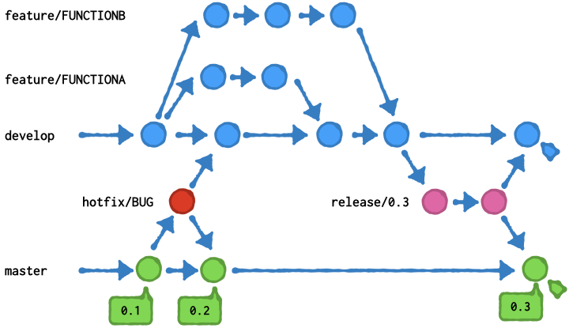

# git flow 簡易マニュアル  

## git flowのブランチ構成
git flowでは以下のようなブランチが作成され運用される。

| ブランチ名       | 用途                                                            |
|------------------|-----------------------------------------------------------------|
| develop          | 開発者が利用する共通ブランチ 最新の機能が全てマージされている   |
| master           | リリース後の最新ブランチ リリースされたバージョンが管理される   | 
| feature/FUNCTION | developブランチに対して機能FUNCTIONが開発されているブランチ     |
| hotfix/BUG       | masterブランチに対しての緊急バグBUGを修正するためのブランチ     |
| release/RELEASE  | developからmasterにRELEASEとしてリリースするためのブランチ      |
|                  |                                                                 |


ブランチ間のマージとブランチ作成は概ね以下のように運用される。



## リポジトリの取得とgit flowの開始

リモートからリポジトリを取得して**git flow**を利用できるように設定します。
```
$ git clone [repository-url]

$ git flow init -d
```


## 機能追加の開始
### `git flow feature start`
developレポジトリに機能を追加するために、featureブランチという新たなブランチを作成します。このコマンドにより`develop`ブランチから`feature/[function-name]`ブランチが作成され、`feature/[function-name]`ブランチに切り替わります。

```
$ git flow feature start [function-name]
Switched to a new branch 'feature/[function-name]'

Summary of actions:
- A new branch 'feature/[function-name]' was created, based on 'develop'
- You are now on branch 'feature/[function-name]'

Now, start committing on your feature. When done, use:

     git flow feature finish [function-name]

$ 
```

### `git flow feature publish`
featureブランチ作成後は、他人と共用できるようにリモートへプッシュしておくと便利です。※初回だけでOK

```
$ git flow feature publish [function-name]
Total 0 (delta 0), reused 0 (delta 0)
remote: 
remote: Create a pull request for 'feature/[function-name]' on GitHub by visiting:
remote:      https://[remote-repository-url]/pull/new/feature/[function-name]
remote: 
To https://[remote-repository-url]
 * [new branch]      feature/[function-name] -> feature/[function-name]
Already on 'feature/[function-name]'
Your branch is up to date with 'origin/feature/[function-name]'.

Summary of actions:
- A new remote branch 'feature/[function-name]' was created
- The local branch 'feature/[function-name]' was configured to track the remote branch
- You are now on branch 'feature/[function-name]'

$ 
```

## 機能追加の完了
### `git flow feature finish`
featureブランチで機能を追加しながらコミットをしていきます。機能の作成とテストが完了するとブランチでの作業を終了して`develop`ブランチにマージします。

コミットを完了した状態で以下のコマンドを実行して`develop`ブランチにマージを実行します。
```
$ git flow feature finish -k [function-name]
```
`-k`オプションをつけると、`feature/[function-name]`ブランチは削除されず維持されます。


`develop`ブランチが他の開発者により成長済だとコンフリクトが発生する場合があるので、その場合はコンフリクトの発生したファイルをエディタで解決し、再度コマンドを実行します。

コマンドが完了して正しくマージが完了していれば、自動的に`develop`ブランチに切り替わるので、プッシュを行いリモートに適用します。
```
$ git push
```

## 他の作業者との共同開発
### `git flow feature track`
追加する機能を共同作業者と開発する場合は、同じfeatureブランチを共同で使用し開発が可能です。（この場合同じファイルを編集するとマージするさいにコンフリクトが発生します。同時に編集するファイルは分けるべきです） リモートをクローンし**git flow**の設定を行います。その後`feature/[function-name]`を取り出して（トラッキング）して作業を開始します。
```
$ git clone [repository-URL]
$ git flow init -d

$ git branch
* develop  ← feature/[function-name]がない!
  master
  
$ git flow feature track [function-name]
Branch 'feature/[function-name]' set up to track remote branch 'feature/[function-name]' from 'origin'.
Switched to a new branch 'feature/[function-name]'

Summary of actions:
- A new remote tracking branch 'feature/[function-name]' was created
- You are now on branch 'feature/[function-name]'

$ git branch
  develop
* feature/[function-name]  ← feature/[function-name]が持ってこられた!
  master
```

### `git flow feature pull origin`
共同作業者によりリモートが修正されている場合は、リモートからプルを行いローカルを最新化することができます。

```
$ git flow feature pull origin
Pulled origin's changes into feature/[function-name].
$ 
```
