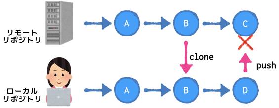
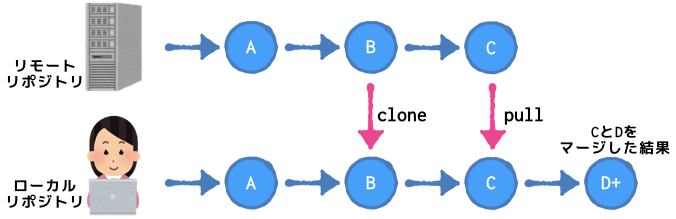

# レポジトリのプルによるマージ

ローカルリポジトリからリモートリポジトリへのプッシュを行おうとした場合、リモートリポジトリ側が別の更新がされている場合プッシュが出来ません。以下のようなログが表示され、プッシュ処理が拒否されます。



* リモートリポジトリが更新されているためプッシュが不可の状態
```
$ git push
To https://[remote-repository-url]
 ! [rejected]        develop -> develop (fetch first)
error: failed to push some refs to 'https://[remote-repository-url]'
hint: Updates were rejected because the remote contains work that you do
hint: not have locally. This is usually caused by another repository pushing
hint: to the same ref. You may want to first integrate the remote changes
hint: (e.g., 'git pull ...') before pushing again.
hint: See the 'Note about fast-forwards' in 'git push --help' for details.
$ 
```

この場合、プルを行いリモートリポジトリに適用された更新をローカルリポジトリに適用する必要があります。
プルを実行すると、リモートリポジトリの変更とローカルリポジトリの変更をマージし以下のような履歴を作成してくれます。マージの際に変更箇所が競合した場合は[競合（コンフリクト）の解決](git-pull-comflict.md)を行う必要があります。



この状態でリモートリポジトリにプッシュすることが可能です。

