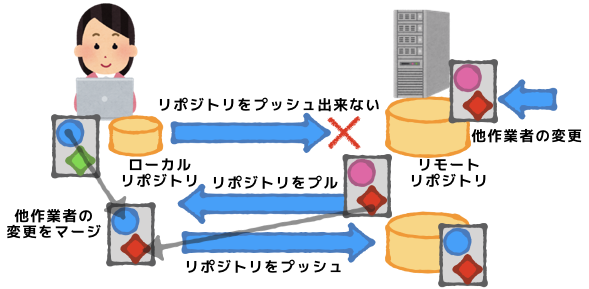

# リモートレポジトリからプル

## プル pull
gitコマンドのプルを使ってリモートのレポジトリでの変更をローカルレポジトリへ持ってくることが可能です。

```
$ git pull
```



クローンしてきたローカルレポジトリを編集している間に、他の作業者がリモートのレポジトリに変更を加えている可能性があります。その場合リモートレポジトリの変更をローカルに取り込まないと、自分の変更をプッシュすることができません。

リモートレポジトリからローカルにプルを行い、他作業者のリモートへの変更をマージします。
変更がかぶった場合コンフリクトが発生するので、コンフリクトを解決する必要があります。


```
$ git pull <remote> <branch>
```
リモートレポジトリ`origin`から`develop`ブランチをぷるしてくる場合は
```
$ git pull origin develop
From https://[remote-repository-url]
 * branch            develop    -> FETCH_HEAD
Already up to date.
$ 
```
のようになります。
